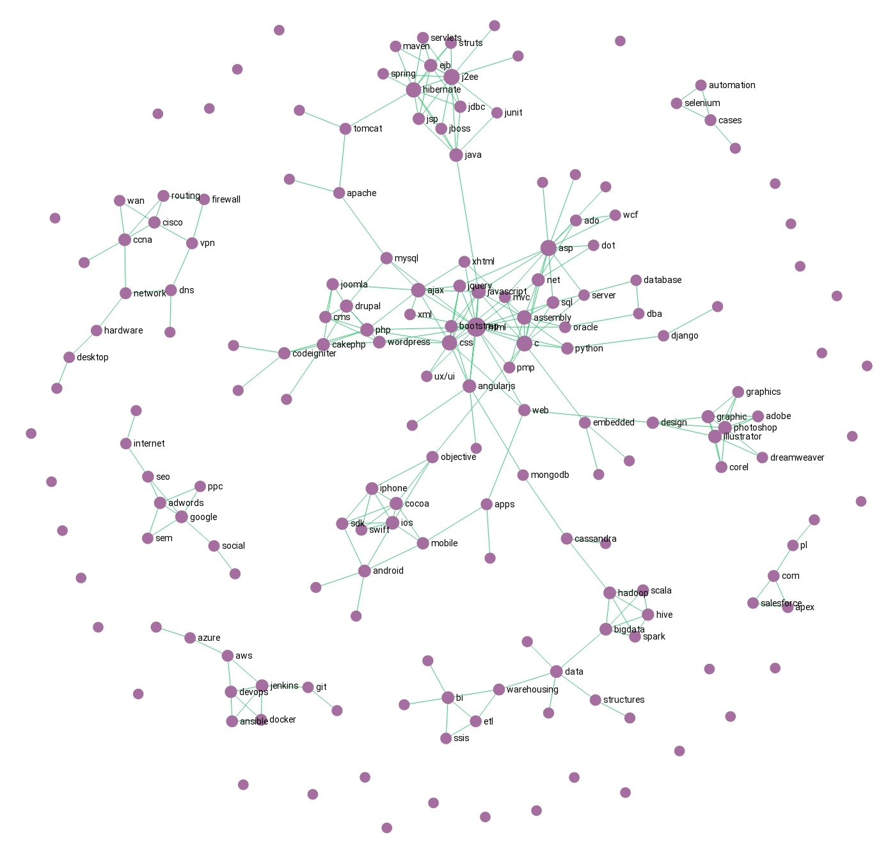
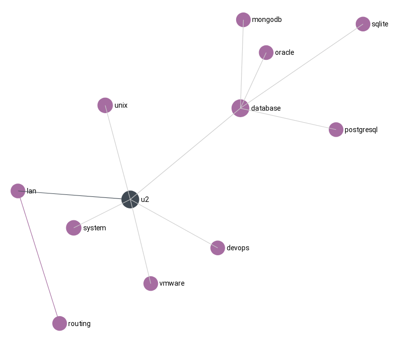

# Library for graph neural networks [graph-nn]

## Short description

This library contains tools for working with graph neural networks, as well as auxiliary modules and algorithms that together allow you to create, train and use models, layers and datasets that work with data in a graph representation.

The library is under active development with the ultimate goal of solving predictive analytics tasks in the field of social network analysis and building career paths for university students and graduates, as well as for companies interested in developing their employees and recruiting staff.

To do this, already at the current stage of development, in addition to the basic models of graph neural networks, examples and tools for creating inherited solutions, the library includes a link parser of the VKontakte social network and HeadHunter labor exchange, as well as algorithms for finding the shortest path in a weighted graph with different types of connections and vertices.

All this together gives researchers and developers the basis for creating their own solutions in the field of graph neural networks for solving complex social and technical problems.

## Repository composition

### Datasets

The library contains definitions for working with [datasets](./gns/dataset) created according to the principles of inheritance from the base class.
The base class of the dataset is set in the [corresponding part of the dataset module](./gns/dataset/dataset.py).
The library also defines private implementations of datasets (social networks) for the development of examples and tests (in particular, [Cora dataset](./gns/dataset/cora.py ) for examples with the analysis of citations of social media messages), and also an example of a dataset for industrial application in terms of job search [SfeduDataset](./gns/dataset/sfedu_dataset.py ) and a special dataset for loading data from the graph database [ArangoDataset](./gns/dataset/arango_dataset.py ).

### Loaders

To download datasets from the server, it was decided to implement a special [Loader](./gns/loaders/single_loader.py) and define the [single data upload](./gns/loaders/single_loader.py) mode for other implemented elements of a graph neural network and several examples. Additionally, appends the [BatchLoader](./gns/loaders/batch_loader.py) for butch data upload and [DisjointLoader](./gns/loaders/disjoint_loader.py) for disjoint loading.

### Graph

The main work of a graph neural network is determined by the base class [Graph](./gns/graph/graph.py), which is a container for data.
The container works with the following parameters:
- `x`: to represent the features of nodes,
- `a`: to represent the adjacency matrix,
- `e`: to represent the attributes of the edges of the graph,
- `y`: to represent the nodes or labels of the graph.

Additionally, an algorithm for finding the shortest Bellman-Ford distance is implemented, represented by the corresponding original [class](./gns/bellman_ford/bellman_ford_original.py) and [modified](./gns/bellman_ford/bellman_ford_modified.py).

### Neural network layers

The following neural network layers were created for the main work of the library:

- Convolutional layer [Chebyshev](./gns/layer/cheb.py) for a graph neural network.
- Main (base) class for [convolutional layer](./gns/layer/convolution.py) Graph neural network.
- [Convolutional](./gns/layer/gcn_convolution.py ) a layer of a graph neural network.
- [A special `GraphConv` layer](./gns/layer/gcs_convolution.py) with a trainable skip connection.
- The main (base) layer class for [GlobalPool](./gns/layer/global_pool.py).
- [Global Sum](./gns/layer/global_sum_pool.py ) is an implementation of the GlobalPoolLayer base class.
- The main layer with the algorithm [GraphSAGE](./gns/layer/graphsage.py).

### Sending messages

To implement the algorithm for promoting information on a graph neural network, an algorithm was implemented via 
[Base Class](./gns/message/generic_message_passing.py) for transmitting messages in a graph neural network (for the `GraphSage` algorithm).

### Models

[The Main model](./gns/model/gcn.py) was also created convolutional neural network, complementing the Tensorflow/Karas model and special industry model [SfeduModel](./gns/model/sfedu_conv_model.py).

### Dispersion models

For the basic message passing function `Generic Message Passing`, as well as a sub-library, scattering models were implemented:
- [scatter_max](./gns/scatter/scatter_max.py): Reduces the number of messages.
- [scatter_mean](./gns/scatter/scatter_mean.py): Averages messages.
- [scatter_min](./gns/scatter/scatter_min.py): Reduces the number of messages.
- [scatter_prod](./gns/scatter/scatter_prod.py): Multiplies messages.
- [scatter_sum](./gns/scatter/scatter_sum.py): Summarizes the messages.

### Transformations

Defined by the transformation base class [LayerPreprocess](./gns/transformation/layer_process.py) - Implements the preprocessing function in the convolutional layer for the adjacency matrix.

### Utilities

The library has a sufficient number of utilities and auxiliary functions:
- [add_self_loops](./gns/utils/add_self_loops.py): Adds loops to a given adjacency matrix.
- [batch_generator](./gns/utils/batch_generator.py): Iterates over data with a given number of epochs, returns as a python generator one packet at a time.
- [chebyshev_filter](./gns/utils/chebyshev_filter.py): Implementation of the Chebyshev filter for a given adjacency matrix.
- [chebyshev_polynomial](./gns/utils/chebyshev_polynomial.py): Computes Chebyshev polynomials from X up to the order of k.
- [check_dtypes](./gns/utils/check_dtypes.py): Checking the data set type.
- [check_dtypes_decorator](./gns/utils/check_dtypes_decorator.py): Decorator for automatic type checking.
- [collate_labels_disjoint](./gns/utils/collate_labels_disjoint.py): Matches this list of labels for disjoint mode.
- [degree_power](./gns/utils/degree_power.py): Calculates the deviation
- [deserialize_kwarg](./gns/utilsdeserialize_kwarg.py): Deserialization of arguments
- [deserialize_scatter](./gns/utils/deserialize_scatter.py): Deserialization of scattering (`scatter`)
- [dot_production](./gns/utils/dot_production.py): Calculates the multiplication of a @b for a and b of the same rank (both 2 or both 3 ranks).
- [gcn_filter](./gns/utils/gcn_filter.py): Filters garf.
- [get_spec](./gns/utils/get_spec.py): Returns a specification (description or metadata) for a tensorflow type tensor.Tensor.
- [idx_to_mask](./gns/utils/idx_to_mask.py): Returns the mask by indexes.
- [load_binary_file](./gns/utils/load_binary_file.py): Loads a value from a file serialized by the pickle module.
- [mask_to_float_weights](./gns/utils/mask_to_float_weights.py): Converts the bit mask into simple weights to calculate the average losses across the network nodes.
- [mask_to_simple_weights](./gns/utils/mask_to_simple_weights.py): Converts the bit mask into simple weights to calculate the average losses across the network nodes.
- [dot_production_in_mixed_mode](./gns/utils/dot_production_in_mixed_mode.py): Calculates the equivalent of the `tf.einsum function('ij, bjk->bik', a, b)`.
- [dot_production_modal](./gns/utils/dot_production_modal.py): Calculates matrix multiplication for a and b.
- [normalized_adjacency_matrix](./gns/utils/normalized_adjacency_matrix.py): Normalizes a given adjacency matrix.
- [normalized_laplacian](./gns/utils/normalized_laplacian.py): Computes the normalized Laplacian of a given adjacency matrix.
- [preprocess_features](./gns/utils/preprocess_features.py): Computing features.
- [read_file](./gns/utils/read_file.py): Reading the file.
- [rescale_laplacian](./gns/utils/rescale_laplacian.py): Scales the Laplace eigenvalues to `[-1,1]`.
- [reshape](./gns/utils/reshape.py): Changes the shape according to the shape, automatically coping with the rarefaction.
- [serialize_kwarg](./gns/utils/serialize_kwarg.py): Serialization of attributes.
- [serialize_scatter](./gns/utils/serialize_scatter.py): Serialization of the scatter.
- [shuffle_inplace](./gns/utils/shuffle_inplace.py): Shuffle `np.random.shuffle`.
- [sparse_matrices_to_sparse_tensors](./gns/utils/sparse_matrices_to_sparse_tensors.py): Transformation of Scipy sparse matrices into a tensor.
- [sparse_matrix_to_sparse_tensor](./gns/utils/sparse_matrix_to_sparse_tensor.py): Converts a sparse Scipy matrix into a sparse tensor.
- [convert_node_objects_to_disjoint](./gns/utils/convert_node_objects_to_disjoint.py): Converts lists of node objects, adjacency matrices, and boundary objects into disjoint mode.
- [to_tensorflow_signature](./gns/utils/to_tensorflow_signature.py): Converts a dataset signature to a TensorFlow signature.
- [transpose](./gns/utils/transpose.py): Transposes parameter `a`, automatically coping with sparsity using overloaded TensorFLow functions.

### Configuration, parameters and settings
#### Library configuration sets a lot of files in the [config](./gns/config) directory.

The main composition (named parameters):
- aggregation methods,
- properties and attributes,
- application constants,
- data types,
- datasets,
- folders,
- named functions,
- initializers,
- models,
- names,
- links.

#### How to use

Can be used like this.

Set up envs

```sh
cp .env.dist .env
```

Create virtual environment
```sh
virtualenv -p <path_to_python> venv
source venv/bin/activate
```

Install packages
```sh
pip install -r requirements.txt
```
or
```sh
make install
```

If you change some packages, you can freeze this with command
```sh
pip freeze > requirements.txt
```
or 
```sh
make freeze
```

### Additional tools
### HH crawler

Defines Vacancies/Keywords DataSet generator from HH.ru.

Collection of simple scripts for crawling vacancies from HH.ru site
via API for generating CSV file by fields data like: name,
description and key skills.

It helps to generate CSV file with following format:
```csv
"$name1 & $description1","key skills1"
"$name2 & $description2","key skills2"
"$name3 & $description3","key skills3"
...
```

Scripts tested on python 3.10 but should work on previous versions too.


#### Get pages

Change `text` field in `download.py` to yours:

```py
text = 'NAME:Data science'
```

Then run script

```sh
cd ./gns/crawlers/hh
python download.py
```

This script will download save results from API to `./docs/pagination`
folder in JSON format.

#### Get details about vacancies

On the next step we need to download extended details about vacancies:

```sh
python parse.py
```

Script will call API and save responses to `./docs/vacancies` folder.

#### Generate CSV

```sh
python generate.py
```

Result will be saved to `./docs/csv` folder.

### VK API crawler

#### How to use

```shell
cd ./gns/crawlers/vk
python main.py <vk_nickname_or_id>
```

### Makefile

A Makefile is provided to automate some tasks. Available commands:
- install: Installing packages.
- freeze: Fixing packages.
- clear: clearing the cache.
- serve: package maintenance:
  - landing,
  - automatic formatting,
  - sorting of imports,
- typing check.
- test: run tests.

## Examples

Examples are provided in the directory [examples](./examples):
- [Test example](./examples/example_citation_gcn.py) for the `Cora` dataset (analysis of the citation graph of social network messages).
- [Test case](./examples/example_citation_cheb.py) for the `Cora` dataset for the Chebyshev Convolutional layer (analysis of the citation graph of social network messages).
- [Simple Test Case](./examples/example_simple_citation.py) for the Cora dataset (analysis of the citation graph of social network messages).
- Examples of finding the shortest distance on a graph for the [Bellman-Ford](./gns/examples/example_bellman_ford_original.py) algorithm and [modified Bellman-Ford](./gns/examples/example_bellman_ford_modified.py) algorithm.
- Industry example for [vacancy search](./examples/example_industry_gsn_model_training.py) - training a model based on data obtained using the SfeduDataset class, the model is a GraphSAGE solution, its tasks include searching for a similar graph describing a vacancy to a graph describing a user.
- Industry example for [generate a large graph compatible with the GNS library using the TechDataset class](./gns/examples/example_industry_gcn_dataset_create.py) - this example demonstrates a way to generate a large graph compatible with the GNS library using the TechDataset class, as a result of the script, two files are created containing 249 (full - jd_data) and 177 (compressed - jd_data2) vertices (depending on the source data set). The data is taken from the source https://github.com/ZhongTr0n/JD_Analysis.
- Industry example [for training a model using data obtained using the TechDataset class](./gns/examples/example_industry_gcn_model_training_simple.py) - an example of training a model using data obtained using the TechDataset class. The model is a standard Graph Convolutional Network, its tasks include searching for possible connections between nodes describing the user's graph: career trajectory.
- industry example [of training the Graph Convolutional Network model with sophisticated verification logic and using advanced methods of using the standard GNS library tools](./gns/examples/example_industry_gcn_model_training.py) - the example also demonstrates the procedure for loading a dataset, its application at the model level, then training takes place, after which the accuracy of the resulting model is displayed. The main task of the model is to search for possible connections between nodes describing the user graph: career trajectory.
- Industry example [to generate a series of small graphs](./gns/examples/example_industry_gsn_dataset_create.py) - this example demonstrates a way to generate a series of small graphs compatible with the GNS library using the SfeduDataset class, graphs describing users and vacancies are selected from it, after which the data is converted into the required format.

To visualize the examples, the data is loaded into ArangoDB, for this [docker-compose file](./docker-compose.yml) with [partition mount](./arangodb_data).

Visualization of the full graph of technologies.



Visualization of the competence graph of a PHP developer.


Visualization of the devops developer competence graph.



Visualization of the competence graph of a JS developer.


### The study is supported by the Research Center Strong Artificial Intelligence in Industry of ITMO University.
